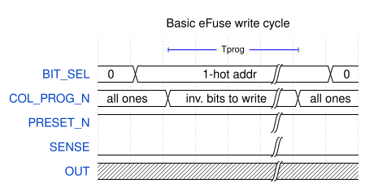
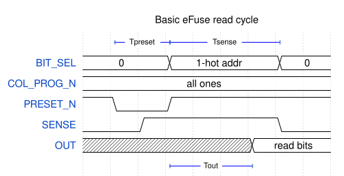

```{{raw}} latex
\pagebreak
```

(efuse_array)=
# Basic eFuse array block (efuse_array)

## Module  efuse_array


## Description

This is a basic eFuse memory block. Contains 16, 32, or 64 word deep eFuse array of arbitrary width plus a sense amplifier circuit.

To write data to the eFuse array, a single word should be selected using one-hot encoding on the `BIT_SEL` bus an inverted data word to write should be provided on the `COL_PROG_N` input. All 0 bits on the `COL_PROG_N` bus will result in blowing of the corresponding fuses in the selected word, and all 1 bits will leave fuses intact. Value on `COL_PROG_N` bus should be kept for at least 50 us (Tprog).



To read data from the eFuse array, first, a sense amplifier circuit should be precharged by keeping `PRESET_N` input low for at least 1 ns (Tpreset). After that, the sensing circuit should be enabled by setting `SENSE` high (at least 10 ns, Tsense), and bringing `PRESET_N` back high. Finally, a word to read should be selected using one-hot encoding on the `BIT_SEL` bus. Output data will be latched to the `OUT` bus no later than 10 ns (Tout) after the address selection.

 

## Verilog parameters

| Parameter    | Description                            |
| ------------ | -------------------------------------- |
| NWORDS       | Number of words in eFuse block (depth) |
| WORD_WIDTH   | Word width                             |

## Ports

| Port name  | Direction | Width            | Description                       |
| ---------- | --------- | ---------------- | --------------------------------- |
| BIT_SEL    | input     | [NWORDS-1:0]     | Word select, one-hot encoding     |
| COL_PROG_N | input     | [WORD_WIDTH-1:0] | Active-low bit write data         |
| PRESET_N   | input     | 1                | Active-low senseamp preset signal |
| SENSE      | input     | 1                | Sense enable (read) signal        |
| OUT        | output    | [WORD_WIDTH-1:0] | Read data bus                     |
