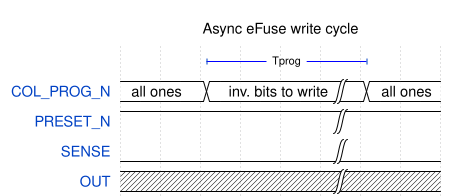
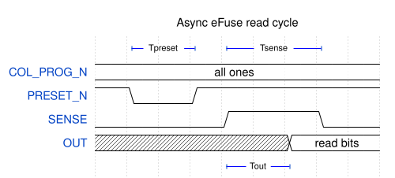

(efuse_array_async)=
# Basic asynchronous eFuse array block (efuse_array_async)

## Module efuse_array_async

## Description

This is a basic asynchronous eFuse memory block which stores whole eFuse array content in latches after a single read. Contains one 8-bit wide word of eFuse plus a sense amplifier circuit per each bit.

To write data to the asynchronous eFuse array, `COL_PROG_N` input bus should be driven with an inverted data word to write. All 0 bits on `COL_PROG_N` bus will result in blowing of the corresponding fuses in the array, and all 1 bits will leave fuses intact. Value on `COL_PROG_N` bus should be kept for at least 1 ms (Tprog).

 

To read data from the eFuse array, first, a sense amplifier circuit should be precharged by keeping `PRESET_N` input low for at least 1 ns (Tpreset) and bringing it back to high after it. After `PRESET_N` is high, the sensing circuit should be enabled by setting `SENSE` high for at least 4 ns (Tsense). Output data will be latched to the `OUT` bus no later than 3 ns (Tout) after the `SENSE` assertion.

 

 

## Verilog parameters

| Parameter name | Value | Description                            |
| -------------- | ----- | -------------------------------------- |
| NWORDS         | 1     | Number of words in eFuse block (depth) |
| WORD_WIDTH     | 8     | Word width                             |

## Ports

| Port name  | Direction | Width            | Description                       |
| ---------- | --------- | ---------------- | --------------------------------- |
| COL_PROG_N | input     | [WORD_WIDTH-1:0] | Active-low bit write data         |
| PRESET_N   | input     | 1                | Active-low senseamp preset signal |
| SENSE      | input     | 1                | Sense enable (read) signal        |
| OUT        | output    | [WORD_WIDTH-1:0] | Read data bus                     |
