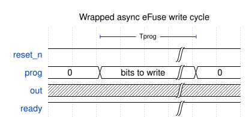
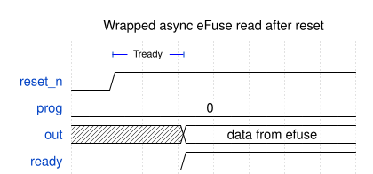

(efuse_async_mem)=
# Asynchronous eFuse memory (efuse_async_mem)

## Module efuse_async_mem

## Description

 This is a small digital wrapper around the {ref}`efuse_array_async` which automatically reads eFuse bits into latches once after reset deassertion.

It's recommended to connect `reset_n` signal to the active-low POR reset to protect fuses during a power-up.

To write the eFuse it's enough to set the corresponding bits on the `prog` bus high for at least 50 us (Tprog). Updated data will be latched after the next reset.

 

eFuse bits are latched to `out` bus no later than after 10 ns (Tready) after reset deassertion. Data readiness will be marked by the `ready` signal going high.
 

 

## Verilog parameters

| Parameter name | Value | Description        |
| -------------- | ----- | ------------------ |
| WDT            | 8     | Async memory width |

## Ports

| Port name | Direction | Width     | Description                                              |
| --------- | --------- | --------- | -------------------------------------------------------- |
| reset_n   | input     | 1         | Active-low reset (POR)                                   |
| prog      | input     | [WDT-1:0] | Data bits to program                                     |
| out       | output    | [WDT-1:0] | Data output, latched automatically after reset           |
| ready     | output    | 1         | Ready signal, goes high after data was latched to output |
