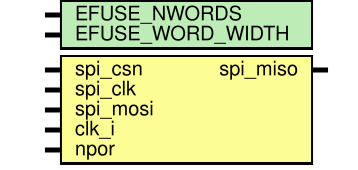
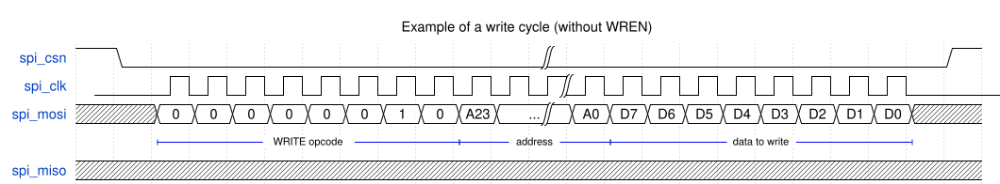
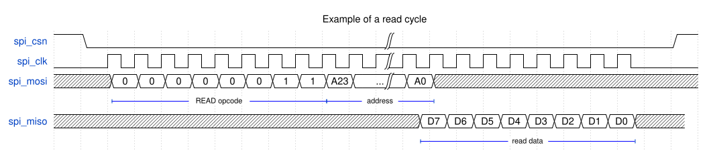

(efuse_spi_mem)=
# eFuse memory with SPI interface (efuse_spi_mem)

## Module efuse_spi_mem

## Description

 This is a digital wrapper around {ref}`efuse_array` providing an EEPROM-like SPI interface to the eFuse memory.

SPI protocol is a subset of the 25-series SPI EEPROMs protocol with active-low chip-select and data latching on the rising clock edge. The protocol consists of sending an 8-bit command opcode to the device first and receiving or sending more data after it, depending on the command. The 24-bit address is used in read and write sequences, but bits exceeding the eFuse depth are ignored. Maximum SPI clock frequency is 10 MHz.

Supported SPI commands are:

| Cmd name | Opcode Hex  | Description                                       |
|----------|-------------|---------------------------------------------------| 
| WRITE    | 0x02        | Write to memory. Only single writes are supported.| 
| READ     | 0x03        | Read from memory. Continuos reading is supported. |
| WRDI     | 0x04        | Disable writing to eFuse array (default).         |  
| RDSR     | 0x05        | Read status register.                             |  
| WREN     | 0x06        | Enable writing to eFuse array.                    |

In order to program the eFuse memory, first, the device must be write-enabled using the WREN instruction (once after reset or `WRDI`). Then the `WRITE` instruction should be transmitted, followed by the 24-bit address and a single byte to be written.

 

 

 Reading the eFuse memory requires the following sequence. After the `spi_csn` is pulled low, the `READ` instruction should be transmitted, followed by the 24-bit address to be read. Data byte at the specified eFuse address is then shifted out via the `spi_miso` line. If only one byte is to be read, the `spi_csn` should be driven high after the last data bit. If `spi_csn` stays low, the read sequence will continue, automatically incrementing the byte address, and data will continue to be shifted out.

 

 

 Readiness of the device to accept the next read/write and write-enable status could be verified by reading the status register with the `RDSR` command.

 

 

## Verilog parameters

| Parameter name   | Description                      |
| ---------------- | -------------------------------- |
| EFUSE_NWORDS     | Number of eFuse words            |
| EFUSE_WORD_WIDTH | Word width (only 8 is supported) |

## Ports

| Port name | Direction | Width |Description                                                            |
| --------- | --------- | ----- |---------------------------------------------------------------------- |
| spi_csn   | input     | 1     | Active-low SPI chip-select                                            |
| spi_clk   | input     | 1     | SPI clock                                                             |
| spi_mosi  | input     | 1     | SPI controller-to-device line                                         |
| spi_miso  | output    | 1     | SPI device-to-controller line                                         |
| clk_i     | input     | 1     | Internal eFuse clock, should be at least 4x faster than the `spi_clk` |
| npor      | input     | 1     | Active-low reset, connection to POR is recommended                    |
