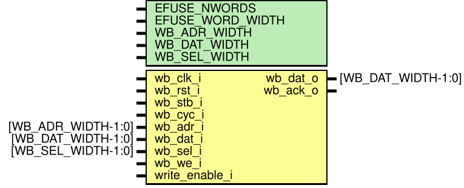

(efuse_wb_mem)=
# eFuse memory with Wishbone interface (efuse_wb_mem)

## Module efuse_wb_mem

## Description

This is a digital wrapper around {ref}`efuse_array` providing a synchronous interface to the eFuse memory with Wishbone bus. Interface should be compatible with the [classic Wishbone SoC bus standard](https://wishbone-interconnect.readthedocs.io/en/latest/03_classic.html). Wishbone addresses are per eFuse word, not per-byte. The maximum supported Wishbone clock frequency is 33 MHz.

It's recommended to connect `write_enable_i` signal to the active-low POR reset to protect fuses during a power-up. 

## Verilog parameters

| Parameter name   | Example value      | Description                                                    |
| ---------------- | ------------------ | -------------------------------------------------------------- |
| EFUSE_NWORDS     | 64                 | Number of eFuse memory words, should be 2^WB_ADR_WIDTH         |
| EFUSE_WORD_WIDTH | 8                  | eFuse word width                                               |
| WB_ADR_WIDTH     | 6                  | Wishbone address bus width                                     |
| WB_DAT_WIDTH     | 8                  | Wishbone data buses width, should be equal to EFUSE_WORD_WIDTH |
| WB_SEL_WIDTH     | (WB_DAT_WIDTH / 8) | Wishbone write mask bus width                                  |

## Ports

| Port name      | Direction | Type               | Description                                  |
| -------------- | --------- | ------------------ | -------------------------------------------- |
| wb_clk_i       | input     |                    | Wishbone clock                               |
| wb_rst_i       | input     |                    | Active-high Wishbone reset                   |
| wb_stb_i       | input     |                    | Wishbone STB signal                          |
| wb_cyc_i       | input     |                    | Wishbone CYC signal                          |
| wb_adr_i       | input     | [WB_ADR_WIDTH-1:0] | Wishbone per-word address                    |
| wb_dat_i       | input     | [WB_DAT_WIDTH-1:0] | Wishbone data to write to eFuse              |
| wb_sel_i       | input     | [WB_SEL_WIDTH-1:0] | Wishbone write mask                          |
| wb_we_i        | input     |                    | Wishbone write enable                        |
| wb_dat_o       | output    | [WB_DAT_WIDTH-1:0] | Wishbone data read from eFuse                |
| wb_ack_o       | output    |                    | Wishbone acknowledge signal                  |
| write_enable_i | input     |                    | Active-high asynchronous write-enable signal |
